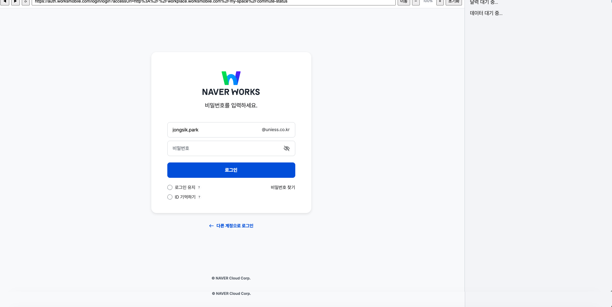
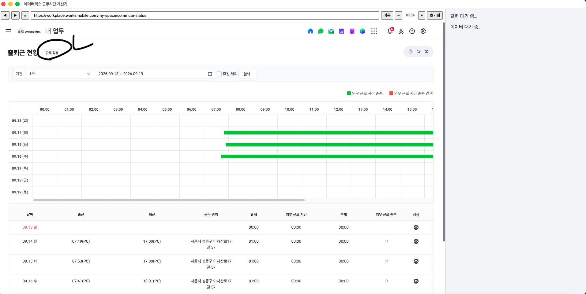
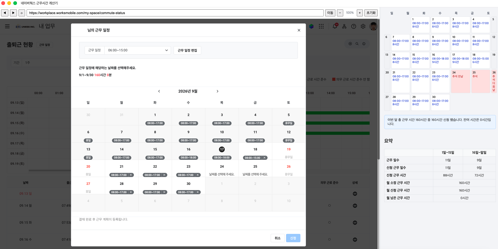

# 네이버웍스 근무시간 계산기 - 배포

네이버웍스 근무시간 계산기 앱의 배포용 저장소입니다. 소스 코드는 비공개 저장소에서 관리되며, 이 저장소에는 빌드된 실행 파일만 [Releases](../../releases)에 업로드됩니다.

## 다운로드

최신 버전은 [Releases](../../releases/latest) 페이지에서 받으세요.

- macOS (Apple Silicon): `WorkHourCalcHelper-*.dmg`
- Windows (x64): `WorkHourCalcHelper-*-win.zip`

## macOS 실행 안내

서명 인증서 없이 빌드된 앱이라, macOS에서 처음 실행 시 Gatekeeper 경고가 뜰 수 있습니다. 앱을 **우클릭 → 열기**로 실행해주세요.

## 사용 방법

**1. 로그인**

앱 내 웹뷰에서 네이버웍스 계정으로 로그인합니다.

**2. 근무 일정 클릭**

출퇴근 현황 화면에서 **근무 일정** 버튼을 클릭합니다.

**3. 근로 시간 선택**

근무 일정 모달에서 날짜별 근로 시간을 선택하면, 오른쪽 패널에 목표/신청 근무시간 요약이 실시간으로 표시됩니다.

